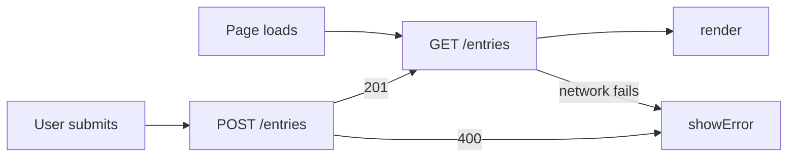

# Travlr Reviews Leave the Browser

## What

**HW3 repository:** `https://github.com/rishikasikhakolli/mgt3745-hw3`

Travlr is a fast, casual photo reviewing app for when a user is vacationing. It allows them to post a photo of anything and everything they did while traveling and prompts them to log a name, photo, and review after visiting it, without the pressure of most social platforms. See [PROJECT.md](context/PROJECT.md) and [FEATURES.md](context/FEATURES.md) for the full spec. As of this week, per [ADR-002](context/ARCHITECTURE.md), the review text now lives in a Cloudflare D1 database behind a Worker instead of the browser's localStorage, so it survives a cleared cache or a switch to another device; the spot name and photo remain client-side only for this iteration.

## See It Work

## How to Run

**Deployed:** `https://mgt3745-hw4.travlr.workers.dev/entries`

From a fresh Codespace:

1. Open the repository in a Codespace. The devcontainer installs xdg-utils and runs `npm install`.
2. `npx wrangler login --device`, then follow [docs/SESSION_B_COMMANDS.md](docs/SESSION_B_COMMANDS.md)
   to create the database, run the schema, and deploy.
3. Paste the deployed URL into `app.js` as `API`.
4. Right-click `index.html`, choose **Open with Live Server**.

To run the Worker locally instead: `npm run dev` (port 8787, local D1 emulator).

## Status

| Feature | EARS statement | Verdict |
|---|---|---|
| Return entries in order | THE SYSTEM SHALL return all entries in creation order | PASS |
| Save an entry | WHEN a valid entry is submitted, THE SYSTEM SHALL store it and confirm | PASS |
| Reject empty entry | IF the entry text is empty or contains only whitespace, THEN THE SYSTEM SHALL reject it and say why | PASS |
| Survive cleared cache | THE SYSTEM SHALL return stored entries on any device | PASS |
| All items in review survive cleared cache | THE SYSTEM SHALL return stored entries on any device | DEFERRED |
| Network down | IF the server cannot be reached, THEN THE SYSTEM SHALL tell the user on the page | CANNOT TEST YET |
| Server returns 500 | IF the server errors, THEN THE SYSTEM SHALL tell the user on the page | CANNOT TEST YET |
| Two clients, one table | Concurrent writes from separate clients are handled safely | DEFERRED (ADR-002) |

*Full verification table lives in [FEATURES.md](context/FEATURES.md).*

## Links

Reading order for a stranger: [PROJECT.md](context/PROJECT.md) →
[USERS.md](context/USERS.md) → [FEATURES.md](context/FEATURES.md) →
[ARCHITECTURE.md](context/ARCHITECTURE.md) → [STANDARDS.md](context/STANDARDS.md) →
[TOOLS.md](context/TOOLS.md) → [STYLE.md](context/STYLE.md) →
[CLAUDE.md](context/CLAUDE.md)

## AI Use

I used Claude to help write the Worker's added validation rule and wire `app.js`'s `load`/`save` functions to fetch calls.

**What did the agent write?** The whitespace-rejection validation rule in `worker.js` (`if (!body.text || !body.text.trim())`), and the fetch-based rewrite of `app.js`'s `load`/`save`/`render` functions, including the client-side metadata layer that keeps spot name and photo alongside the server-stored review text.

**What did I check, and how?** I read every line before deploying, and manually traced the Worker's POST path against `schema.sql`. I tested the empty/whitespace rejection by submitting blank and space-only reviews.

**What could I not fully verify, and what did I do about it?** I did not fully verify that matching local photo/spot-name metadata to server entries by array position would stay correct. After a few submissions, photos and spot names appeared attached to the wrong review text on screen. I diagnosed this myself, then had Claude help me change the approach to key metadata by the server-assigned entry `id` (returned from the Worker's INSERT via `result.meta.last_row_id`) instead of by array position, which fixed the mismatch.

**Hours spent:** ~9
