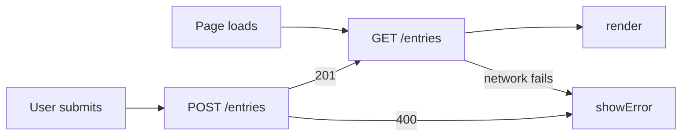

# Entries: Data Leaves the Browser

> Replace this title and every *italic prompt* with your own words. Six
> sections, in this order: What, See It Work, How to Run, Status, Links,
> AI Use. GitHub renders this page; it can show, not only tell.

## What

**HW3 repository:** https://github.com/rishikasikhakolli/mgt3745-hw3

Travlr is a fast, casual photo reviewing app for when a user is vacationing. It allows them to post a photo of anything and everything they did while traveling and prompts them to log a name, photo, and review after visiting it, without the pressure of most social platforms. See [PROJECT.md](context/PROJECT.md) and [FEATURES.md](context/FEATURES.md) for the full spec. As of this week, per [ADR-002](context/ARCHITECTURE.md), the review text now lives in a Cloudflare D1 database behind a Worker instead of the browser's localStorage, so it survives a cleared cache or a switch to another device; the spot name and photo remain client-side only for this iteration.

*One paragraph naming the problem, the user, and the feature, with links to
[PROJECT.md](context/PROJECT.md) and [FEATURES.md](context/FEATURES.md).
One sentence on where data now lives and why (ADR-002).*

## See It Work

## How to Run

Deployed: *`https://mgt3745-hw4.travlr.workers.dev/entries`*

From a fresh Codespace:

1. Open the repository in a Codespace. The devcontainer installs xdg-utils and runs `npm install`.
2. `npx wrangler login --device`, then follow [docs/SESSION_B_COMMANDS.md](docs/SESSION_B_COMMANDS.md)
   to create the database, run the schema, and deploy.
3. Paste the deployed URL into `app.js` as `API`.
4. Right-click `index.html`, choose **Open with Live Server**.

To run the Worker locally instead: `npm run dev` (port 8787, local D1 emulator).

## Status

| Feature | EARS statement | Verdict |
|---|---|---|
| *Save an entry* | *WHEN a valid entry is submitted, THE SYSTEM SHALL store it* | *PASS* |
| *Reject empty entry* | *IF text is missing, THEN THE SYSTEM SHALL reject with a reason* | *PASS* |
| *Survive cleared cache* | *THE SYSTEM SHALL return stored entries on any device* | *PASS* |
| *Network down* | *IF the server is unreachable, THE SYSTEM SHALL tell the user* | *CANNOT TEST YET* |
| *Two clients, one table* | *...* | *DEFERRED (ADR-002)* |

*Full verification table lives in [FEATURES.md](context/FEATURES.md).*

## Links

Reading order for a stranger: [PROJECT.md](context/PROJECT.md) →
[USERS.md](context/USERS.md) → [FEATURES.md](context/FEATURES.md) →
[ARCHITECTURE.md](context/ARCHITECTURE.md) → [STANDARDS.md](context/STANDARDS.md) →
[TOOLS.md](context/TOOLS.md) → [STYLE.md](context/STYLE.md) →
[CLAUDE.md](context/CLAUDE.md)

## AI Use

*Three proto-DDR questions. What did the agent write? What did you check,
and how? What could you not fully verify, and what did you do about it?
For the Worker specifically: name the thing you could not fully inspect.
Hours spent: ___.*
