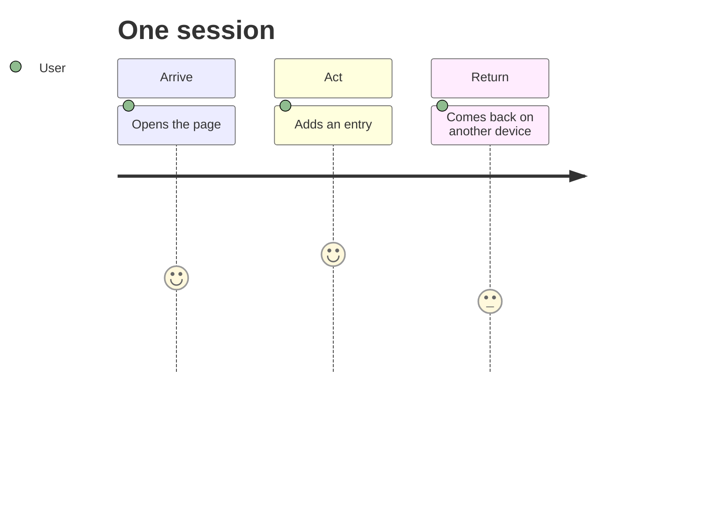

# USERS.md

Copy in from HW2, with revisions from feedback.

## Primary user
*Name, role, goal, friction. Where they are when they use this.*
As someone who travels casually, PROFILE-01 is someone who wants a fast way to combine all their travel highlights and updates into one place so their friends can come along the journey with themm, but not be bombarded by frequent updates over more commonplace applications. They desire a low-pressure location to share their pictures, thoughts, and recommendations. Today, they usually text photos, stories, and specific location recommendations directly over messaging apps. This current approach is unsatisfying because sending scattered text messages is fragmented and could be annoying for the receiver (pressure to respond). One thing to consider is the desire for a response, so including a comment section so the sharing is more interactive for both parties.

## Secondary user
As an active social media user who enjoys documenting their travels, they want a way to evaluate generate visually appealing travel logs that match design standards but maybe doesn't have a image restriction or as much of a pressure-environment. They want a place to showcase highlights into curated reviews that document their trip aesthetically. They searched for itinerary ideas from numerous tools and is meticulous with photos they takes from their events. This current approach is constrained because they are limited to high-pressure sharing environments where shared thoughts are often short or non-existent.

## Journey

